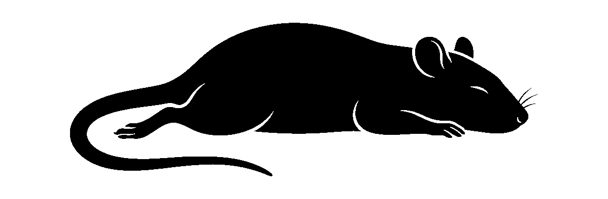

<div align="center">
  
</div>

<div align="right">
  <strong>中文</strong> | <a href="README.md">English</a>
</div>

# AgentPet

AgentPet 是一款极简的 macOS 状态栏应用，它会在你的系统菜单栏里常驻一只小宠物。

### 这个应用是干什么的？
AgentPet 的核心作用是一个**后台任务状态指示器**，专为 AI Agent、开发者和自动化脚本量身定制。
告别枯燥的加载圈和终端日志。每当AI 助手、自动化脚本正在后台“思考”、“打字”或高负荷运转时，你的小宠物会在状态栏里全力奔跑；而当任务完成时，它则会安静地趴下睡觉。

### 核心特性
- **免配置监控 Antigravity**：原生深度集成。只需要打开应用，它就会自动在底层监控 Antigravity Agent 的日志。没有任何脚本，也无需配置。
- **多种形态切换**：点击菜单随时在“小黑猫”和“花枝鼠”之间切换，未来还会加入更多小动物。
- **动态状态反馈**：任务进行时奔跑，闲置时睡觉。

### 如何使用
1. 直接双击运行 `AgentPet.app`，小动物就会立刻出现在你的 macOS 屏幕右上角。
2. 点击状态栏中的小动物，可以在下拉菜单中切换形状, 只要 AI 在思考，小动物就会奔跑。

### 自定义脚本监控（进阶/开发者使用）
AgentPet 默认还会监听本地的 `.agentpet_status` 文件作为自定义拓展。你可以通过任意其他脚本修改它来控制小动物。
向状态文件写入 `working`：
```bash
echo "working" > ~/.agentpet_status
```

**让小宠物休息：**
向状态文件写入其他任何内容（或清空文件）：
```bash
echo "idle" > ~/.agentpet_status
```
